<h1 align="center">🐉 道锋潜麟</h1>

  嵌入式、前后端、自部署服务，以及把数字角色带进现实世界的硬件创作。

  
  
  
  
  

  
  

---
欢迎来到我的GitHub个人主页！

这里是 **道锋潜麟**，一只赛博飞升义体改造的 furry 黄龙。

## 涉猎方向

| 方向 | 能力范围 |
| --- | --- |
| **嵌入式与硬件** | MCU、开发板、外设、控制逻辑和真实设备落地。 |
| **后端与服务** | API、权限、数据存储、任务处理和后台系统。 |
| **前端与交互** | Web 控制台、管理界面、可视化和用户工作流。 |
| **Linux 与边缘计算** | ARM/Linux 设备、边缘视觉、现场部署和系统调试。 |
| **运维与基础设施** | 自部署服务、容器、对象存储、DNS/CDN 和自动化维护。 |
| **创作者工具与社区系统** | 面向活动、图库、投稿、协作和数字角色表达的工具。 |
| **文档与产品化** | 把项目整理到可理解、可部署、可长期维护。 |

整体来说，我更像是偏硬件和基础设施的全栈型开发者：能从 MCU / 开发板一路接到后端、前端、部署和运维，把一个想法落成可运行、可维护的完整系统。

## 技术栈

**语言**

  
  
  
  
  
  

**框架与库**

  
  
  
  
  
  
  
  

**服务与数据**

  
  
  
  

**平台与硬件**

  
  
  
  
  

**工程工具**

  
  
  
  
  

## AI 协作

我会把 AI 工具作为结对开发和工程检索的一部分，用来加速阅读、整理、验证与迭代。主要使用：

  
  
  

系统边界、硬件约束、架构取舍、发布验收和最终代码责任仍然由我来把关。

## 做事方式

- 从硬件约束出发设计软件，而不是只从抽象接口出发。
- 倾向于把设备端、协议、服务端、前端后台、文档和部署流程作为一个完整系统来做。
- 喜欢能长期自部署、可维护、可排障的工具，而不是只在截图里好看的项目。
- 写代码时会同时考虑真实现场的断网、断电、误触、权限、存储、升级和回滚。
- 保留一点幻想设定和创作表达，但工程实现必须落地、可测、可复现。

---

  
  

